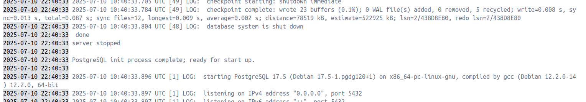
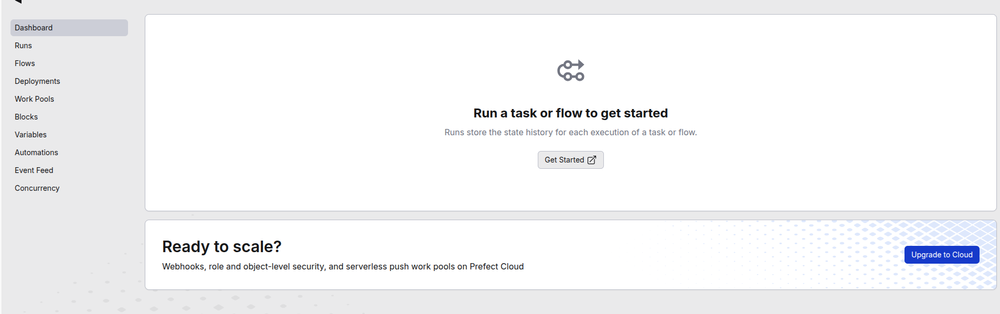
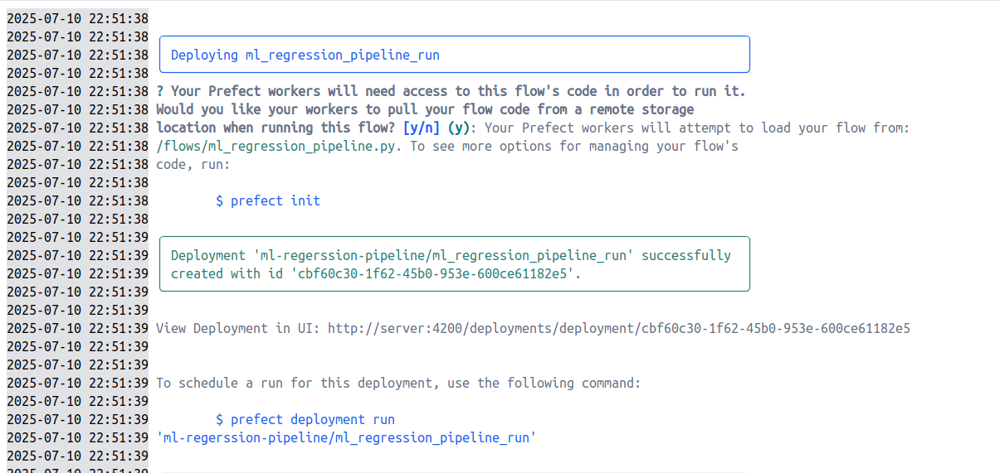
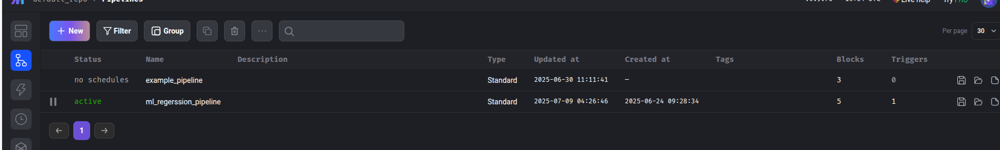
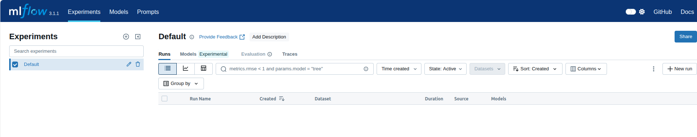
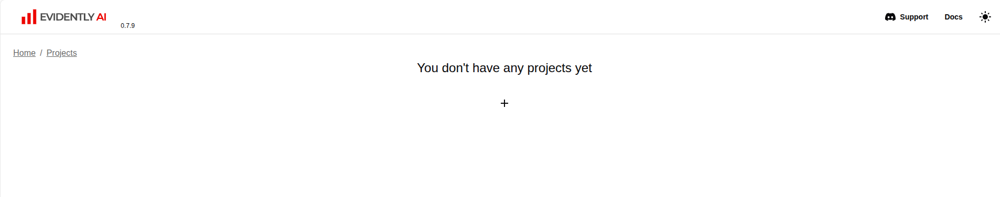
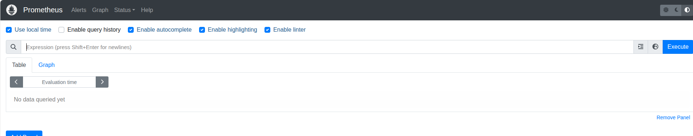
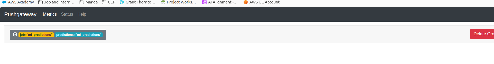

## Objective

This project builds a simple, end-to-end machine learning system that predicts how strong a chemical compound’s effect might be in a lab test, using only a few basic traits of the compound. The dataset comes from a public bioactivity resource called **ChEMBL**.

Each compound in the dataset is described by four features, which the model uses to make its prediction:

| Column Name     | Description                                 | Why It's Useful                                                               |
|-----------------|---------------------------------------------|-------------------------------------------------------------------------------|
| `mw_freebase`   | Molecular Weight – how heavy the molecule is | Heavier or lighter compounds behave differently in chemical reactions        |
| `alogp`         | LogP – whether the compound prefers oily or watery environments | Affects how the compound travels in the body or interacts with cells         |
| `hba`           | Hydrogen Bond Acceptors – how many "hands" the molecule has to receive hydrogen bonds | Influences how sticky or interactive the compound is                         |
| `hbd`           | Hydrogen Bond Donors – how many "hands" it has to give hydrogen bonds | Affects how well it binds or interacts with other molecules                 |

Using just these four inputs, the model predicts a fifth value:

- **`standard_value`**: A numerical measure of the compound's activity in a biological test. Lower values generally mean stronger activity.


## High-Level Architecture

- **Data Storage**  
  All compound data, are stored in a PostgreSQL database for reliable and centralized access.

- **Pipeline Orchestration**  
  Mage and Prefect coordinate and manage the data workflows, including data loading, model training, and batch or streaming prediction jobs.

- **Experiment Tracking and Logging**  
  MLflow is used to track model versions, log training metrics, and manage model artifacts, ensuring reproducibility and auditability.

- **Data Quality and Model Monitoring**  
  Evidently monitors input data quality and model performance over time, detecting drifts or anomalies in predictions.

- **Metrics Collection and Visualization**  
  Prometheus collects runtime metrics, including prediction statistics , which are visualized in Grafana dashboards for real-time monitoring.

- **Model Serving**  
  The trained model is served via MLflow endpoints, enabling real-time predictions through API calls.

- **Synthetic Data Generation and Streaming**  
  Synthetic Data Vault (SDV) generates realistic synthetic compound data which is pushed into Kafka streams.

- **Data Consumption and Prediction**  
  A Kafka consumer listens to these streams, processes incoming data by calling the MLflow model serving API, and obtains predictions.

- **Metrics Export and Monitoring**  
  Prediction results and related metrics are pushed to a Prometheus Pushgateway, allowing Prometheus to scrape them and Grafana to display updated dashboards.

- **Dockerized and Local Setup**  
  The entire system is containerized using Docker, enabling easy local development, testing, and deployment without external dependencies.


This architecture supports an end-to-end automated, scalable, and monitored machine learning pipeline for chemical compound activity prediction.


## Dataset Preperation 

The dataset is sourced from ChEMBL, a curated database of bioactive molecules with drug-like properties. For this project, a subset focused on a single biological target was selected to keep the problem constrained and interpretable.

The preperation of the data set involves the following steps:

1) Navigate to the Miscallaneous directory open the file DataPull.txt

2) Navigate to the data folder and run the command in the terminal to download the dataset:
    
    
    ```
    wget -c ftp://ftp.ebi.ac.uk/pub/databases/chembl/ChEMBLdb/latest/chembl_34_sqlite.tar.gz


    ```

3) Run the command in the terminal to extract the dataset:
    
    
    ```
    tar -xvzf chembl_34_sqlite.tar.gz

    ```

4) Mount the dmp file and run a posgres Docker container 

5) Run the command in the terminal to create the database and tables:
    
    
    ```
    createdb -h localhost -p 5432 -U postgres chembl35`

    ```


    ```
      pg_restore --no-owner \
      -h localhost \
      -p 5432 \
      -U postgres \
      -d chembl35 \
      -v data/chembl_35/chembl_35_postgresql/chembl_35_postgresql.dmp
      
    ```

6) Connect to the database and check if the dunmp is resotred successfully concluding the first part of the dataset preparation.

7) Open the script ML_DATASET_PREP.sql and run the below query 

    ```
    CREATE TABLE public.chembl_ml_dataset AS
        SELECT 
        	a.activity_id,
            a.assay_id,
            a.molregno,
            a.standard_type,
            a.standard_value,
            a.standard_units,
            a.pchembl_value,
            s.assay_type,
            s.confidence_score,
            s.description AS assay_description,
            c.mw_freebase,
            c.alogp,
            c.hba,
            c.hbd,
            --c.ro5_violations,
            cs.canonical_smiles,
            di.mesh_heading,
            di.efo_term,
            --di.indication_class,
            t.pref_name AS target_name,
            t.target_type,
            tc.component_id
        FROM 
            public.activities a
        JOIN 
            public.assays s ON a.assay_id = s.assay_id
        JOIN 
            public.compound_properties c ON a.molregno = c.molregno
        JOIN 
            public.compound_structures cs ON a.molregno = cs.molregno
        JOIN 
            public.drug_indication di ON a.molregno = di.molregno
        JOIN 
            public.target_dictionary t ON s.tid = t.tid
        JOIN 
            public.target_components tc ON tc.tid = t.tid;

    ```

8) Run the below command to create a dump file of the table 


  ```
  pg_dump -U postgres -d chembl_35 -t public.chembl_ml_dataset -Fc -f chembl_ml_dataset.dump

  ```

9) This concludes the dataset preparation. The `chembl_ml_dataset.dump` file can now be used to restore the dataset in any PostgreSQL database.


## Docker Setup

Each service in the system runs in its own Docker container to ensure isolation, reproducibility, and ease of deployment. Below is a summary of what each container does:


## Container Architecture

Each service in this project runs as a Docker container. Below is a summary of each container's role:

| Container             | Purpose                                                                 |
|------------------------|-------------------------------------------------------------------------|
| `postgres`            | Relational database storing ChEMBL data, synthetic samples, and logs.   |
| `jupyter`             | Jupyter Notebook for interactive exploration and debugging.              |
| `mage`                | ETL orchestration and pipeline management using Mage.                   |
| `mlflow`              | Experiment tracking and model serving (via MLflow REST API).            |
| `prefect-server`      | Orchestrates workflow execution, schedules batch/stream pipelines.      |
| `worker`              | Executes Prefect tasks from a specified work queue.                     |
| `cli`                 | Runs one-time Prefect deployment.                                       |
| `evidently`           | Tracks data quality and monitors model drift in live predictions.       |
| `prometheus`          | Collects runtime metrics from various services.                         |
| `pushgateway`         | Accepts metrics pushed from prediction services for Prometheus scraping.|
| `grafana`             | Displays metrics and dashboards from Prometheus in real time.           |
| `minio`               | Object storage backend for models and artifacts (optional S3replacement).|
| `kafka`               | Streams synthetic compound data using a predefined topic.               |
| `sdv-simulator`       | Periodically generates synthetic data using SDV and pushes to Kafka.    |
| `model-server-sgd`    | Serves the SGDRegressor model using MLflow REST API.                    |
| `model-server-xgboost`| Serves the XGBoost model using MLflow REST API.                         |
| `model-server-nn`     | Serves the Neural Network model using MLflow REST API.                  |
| `model-server-rf`     | Serves the Random Forest model using MLflow REST API.                   |
| `prediction-consumer` | Listens to Kafka, fetches predictions from model APIs, pushes metrics.  |

All containers are connected via a shared Docker bridge network called `my_network`. Volumes are used to persist data, models, and configurations across services.

## Container Environment Variables

| Container               | Environment Variable                 | Description                                         |
|-------------------------|-----------------------------------|-----------------------------------------------------|
| **postgres**            | `POSTGRES_USER`                   | Username for PostgreSQL database access.             |
|                         | `POSTGRES_PASSWORD`               | Password for the PostgreSQL user.                     |
|                         | `POSTGRES_DB`                    | Default database name created at startup.            |
|                         | `POSTGRES_MAX_WAL_SIZE`           | Maximum write-ahead log size (e.g., 1GB).            |
| **jupyter**             | `JUPYTER_TOKEN`                   | Token for Jupyter notebook access (empty disables).  |
|                         | `JUPYTER_PASSWORD`                | Password for Jupyter notebook access.                 |
| **mage**                | `MAGE_DATABASE_CONNECTION_URL`   | Database connection string Mage uses to connect.      |
| **mlflow**              | `MLFLOW_TRACKING_URI`             | URL where MLflow tracking server runs.                |
|                         | `BACKEND_STORE_URI`               | Database connection string for MLflow backend store. |
|                         | `ARTIFACT_ROOT`                  | Location where MLflow stores model artifacts.         |
| **prometheus**          | -                                 | No environment variables configured; uses config file.|
| **grafana**             | `GF_SECURITY_ADMIN_USER`          | Admin username for Grafana UI.                         |
|                         | `GF_SECURITY_ADMIN_PASSWORD`      | Admin password for Grafana UI.                         |
|                         | `GF_AUTH_ANONYMOUS_ENABLED`       | Enables anonymous access if true.                      |
|                         | `GF_AUTH_ANONYMOUS_ORG_ROLE`      | Role assigned to anonymous users (e.g., Admin).       |
|                         | `GF_AUTH_DISABLE_LOGIN_FORM`      | Disables login form if true.                           |
| **minio**               | -                                 | No environment variables configured; default settings.|
| **server (Prefect)**    | `PREFECT_UI_URL`                  | URL to access the Prefect UI.                          |
|                         | `PREFECT_API_URL`                 | API URL for Prefect server.                            |
|                         | `PREFECT_SERVER_API_HOST`          | Host address where Prefect server listens.            |
|                         | `PREFECT_API_DATABASE_CONNECTION_URL` | Database connection URL for Prefect backend.       |
| **worker (Prefect)**    | `PREFECT_API_URL`                 | API URL for Prefect server communication.             |
| **cli (Prefect)**       | `PREFECT_API_URL`                 | API URL for Prefect server communication.             |
| **evidently**           | -                                 | No environment variables configured.                  |
| **pushgateway**         | -                                 | No environment variables configured.                  |
| **sdv-simulator**       | `SAMPLE_INTERVAL`                 | Interval in seconds between synthetic data generation.|
|                         | `ML_DATASET_DBNAME`               | Database name where synthetic data is stored.         |
|                         | `POSTGRES_SCHEMA`                 | Postgres schema name.                                  |
|                         | `POSTGRES_USER`                  | Postgres username.                                     |
|                         | `POSTGRES_PASSWORD`              | Postgres password.                                     |
|                         | `POSTGRES_HOST`                  | Postgres hostname.                                     |
|                         | `POSTGRES_PORT`                  | Postgres port.                                         |
| **kafka**               | `KAFKA_CLUSTER_ID`               | Unique ID for Kafka cluster.                           |
|                         | `KAFKA_CFG_NODE_ID`              | Node identifier for Kafka broker.                      |
|                         | `KAFKA_CFG_PROCESS_ROLES`        | Roles assigned to Kafka process (broker, controller). |
|                         | `KAFKA_CFG_CONTROLLER_QUORUM_VOTERS` | Quorum voters for controller election.             |
|                         | `KAFKA_CFG_LISTENER_SECURITY_PROTOCOL_MAP` | Maps listeners to security protocols.           |
|                         | `KAFKA_CFG_CONTROLLER_LISTENER_NAMES` | Names of controller listeners.                      |
|                         | `KAFKA_CFG_LISTENERS`            | Listener addresses and ports.                          |
|                         | `KAFKA_CFG_ADVERTISED_LISTENERS` | Advertised listener addresses.                         |
|                         | `ALLOW_PLAINTEXT_LISTENER`       | Enables plaintext communication (yes/no).             |
|                         | `KAFKA_CFG_AUTO_CREATE_TOPICS_ENABLE` | Enables auto topic creation.                         |
| **model servers**       | `MLFLOW_TRACKING_URI`             | MLflow tracking server URL.                            |
| (sgd, xgboost, nn, rf)  | `MODEL_NAME`                     | Registered model name to serve.                        |
|                         | `MODEL_STAGE`                    | Model stage to serve (e.g., Production).              |
| **prediction-consumer** | `KAFKA_BOOTSTRAP_SERVERS`         | Kafka bootstrap server addresses.                      |
|                         | `KAFKA_TOPIC`                   | Kafka topic to listen for synthetic data.             |


## Container Volumes

| Container               | Volume Path in Host                        | Mount Point in Container                          | Purpose                                                                 |
|-------------------------|--------------------------------------------|---------------------------------------------------|-------------------------------------------------------------------------|
| **postgres**            | `../data`                                  | `/data`                                           | Stores SQL dump files for ChEMBL import.                               |
|                         | `../db-init`                               | `/docker-entrypoint-initdb.d`                    | Auto-executes SQL scripts on first-time DB initialization.             |
|                         | `.env`                                     | `/docker-entrypoint-initdb.d/.env`               | Makes env variables available during DB initialization.                |
| **jupyter**             | `../../data`                                | `/data`                                           | Access to compound dataset.                                            |
|                         | `../models`                                | `/models`                                         | Access to trained ML models.                                           |
| **mage**                | `../mage`                                   | `/home/src`                                       | Mage project source code and flows.                                    |
|                         | `../mlflow-artifacts`                      | `/mlflow-artifacts`                               | Shared artifact store with MLflow.                                     |
|                         | `../models`                                | `/home/src/models`                                | Stores trained models for Mage workflows.                              |
| **mlflow**              | `../mlflow-artifacts`                      | `/mlflow-artifacts`                               | Persists model artifacts.                                              |
| **grafana**             | `../grafana/dashboards/dashboards.yaml`    | `/etc/grafana/provisioning/dashboards/dashboards.yaml` | Auto-provision dashboard configs.                                      |
|                         | `../grafana/dashboards/json`               | `/var/lib/grafana/dashboards`                    | Stores actual dashboard JSON files.                                    |
|                         | `../grafana/datasources`                   | `/etc/grafana/provisioning/datasources`          | Pre-configures Prometheus as a data source.                            |
| **minio**               | `../minio`                                  | `/data`                                           | Bucket storage backend for MLflow (optional).                          |
| **server (Prefect)**    | `../prefect`                                | `/root/.prefect`                                  | Prefect server local state and metadata.                               |
| **worker (Prefect)**    | `../flows`                                  | `/flows`                                          | Flow files used by the Prefect worker.                                 |
| **cli (Prefect)**       | `../flows`                                  | `/flows`                                          | CLI container used for deploying Prefect flows.                        |
| **sdv-simulator**       | `../sdv/generate_data.py`                  | `/app/generate_data.py`                           | Script for generating synthetic data.                                  |
| **model servers**       | `../mlflow-artifacts`                      | `/mlflow-artifacts`                               | Access to MLflow model artifacts.                                      |
| (sgd, xgboost, nn, rf)  | `../models`                                | `/models` (or equivalent per container)           | Additional model files if needed.                                      |
| **prediction-consumer** | `../consumer/consumer.py`                  | `/app/consumer.py`                                | Kafka consumer logic that triggers model inference.                    |


We will split the running of the project into two parts:

 1) Running the project for dataset preparation and model training
 2) Running the project for prediction serving

## Running the Project for model training and dataset preparation


1) Navigate to the folder Docker and run the command in the terminal to build the docker images:
    
    ```
    docker compose build

    ```
  This is a one time step 

2) Run the command in the terminal to start the containers:
    
    ```
    docker compose up -d

    ```
  
3) Make sure the DB is up 

   


4) Next Ensure dockers server,worker,minio and cli are up and running

   

   http://localhost:4200/dashboard

   


5) Ensure mage is up and running

   

    http://localhost:6789

6) Ensure MLflow is up and running

   

    http://localhost:5000
    
7) Simlarly Ensure Evidently, Prometheus, Grafana and Push Gateway are up and running

   

   http://localhost:8085/

   

   http://localhost:9090

   

   http://localhost:3000

   

   http://localhost:9091
    

8) With these containers in place we are ready to trigger the mage pipeline
   Further screenshots will not be provided as UI is very intuitive and easy to use.

   The prefect flow can be triggered by executing the below command in the terminal of cli container:
    
    ```
    prefect deployment run  'ml-regerssion-pipeline/ml_regression_pipeline_run'

    ```

9) This triggers the mage pipeline which will run the following steps:

   - Load the dataset from PostgreSQL
   - Train the models (SGDRegressor, XGBoost, Neural Network, Random Forest)
   - Log the models and metrics to MLflow
   - Push metrics to Prometheus Pushgateway Grafana and Evidently

  Screenshots will not be provided for the above steps as they are self-explanatory and can be easily verified in the respective UIs.


## An explanation of the mage pipeline and prefect flow is provided below


1) Prefect flow :- 

Path :- 

      ```
          /flows/ml_regression_pipeline.py
      
      ```

This Prefect flow is designed to orchestrate batch-based training of machine learning models using a Mage pipeline. It reads data from a PostgreSQL table, splits it into batches, and triggers the Mage pipeline for each batch while passing along model type and hyperparameters. The goal is to support grid search-style experimentation for multiple regression models by handling one batch at a time, monitoring each run until completion. This setup enables scalable and modular training workflows, where data loading, model training, and tracking are managed in a controlled and repeatable way. All services run locally and are fully containerized using Docker.


To add models / hyperparameters to the grid search, you can modify the below section of the code:

```python

 batches = 5
    batch_size = total_rows // batches
    
    # -------------- grid search definition -------------------------
    search_space = []
    #rf_grid = [{"max_depth": d} for d in [3, 5, 7]]
    #xgb_grid = [{"eta": e} for e in [0.05, 0.1, 0.3]]
    #sgd_grid = [{"alpha": a} for a in [0.0001, 0.001, 0.01]]
    #nn_grid = [
    #{"hidden_layer_sizes": (64, 32), "learning_rate_init": 0.01, "max_iter": 1, "warm_start": True},
    #{"hidden_layer_sizes": (128,), "learning_rate_init": 0.005, "max_iter": 1, "warm_start": True},
    #        ]
    
    rf_grid = [{"max_depth": d} for d in [7]]
    xgb_grid = [{"eta": e} for e in [0.3]]
    sgd_grid = [{"alpha": a} for a in [0.0001]]
    nn_grid = [
    {"hidden_layer_sizes": (64, 32), "learning_rate_init": 0.01, "max_iter": 1, "warm_start": True}
            ]
    
    for p in rf_grid:
        search_space.append(("RandomForest", p))
    for p in xgb_grid:
        search_space.append(("XGBoost", p))
    for p in sgd_grid:
        search_space.append(("SGDRegressor", p))
    for p in nn_grid:
        search_space.append(("NeuralNet", p))
    # ---------------------------------------------------------------

    is_last_batch=False 

    #for model_type, params in search_space:
    for model_type, params in filter(lambda x: x[0] == "XGBoost", search_space):

```


## Running the Project for prediction and serving


1) We will now asssume that all the models have been trained and registered in MLflow.

2) Since training takes a long time and we will be persisting the mleflow DB . 
   For this navigate to the mlfow schema using dbeaver and export all tables as insert statements.
   
   Add the insert statements to a file called `mlflow_dump_combined_xgboost.sql` in the `data` folder. You could alternatively name the file anything you like. 

   Make sure the insert statements are in the correct table order else Foreign key constraints will fail.

   The order is given in the script and is as below 


   ```sql 

    ----table order 
    --alembic_version
    --experiments
    --datasets
    --inputs
    --runs
    --tags
    --metrics
    --input_tags
    --latest_metrics
    --registered_models
    --model_versions
    --params
    --logged_models
    --logged_model_tags
    --model_version_tags
    --logged_model_params
    --logged_model_metrics


   ```


  3) Once this is done you can safely turn off all the containers.


  4) Run the below containers :- 

    1) Postgres
    2) Mlflow
    3) Grafana
    4) Prometheus
    5) Pushgateway
    6) sdv-simulator
    7) Kafka  

  Initially there will be no data in the mlflow DB and the UI will also be empty.

  Then run the SQL script to restore the mlflow DB with the insert statements you created in step 2.

  Once you inspect the UI you will see the models registered in MLflow.


  5) Next we will run the model serving containers.

    1) model-server-sgd
    2) model-server-xgboost
    3) model-server-nn
    4) model-server-rf
    5) prediction-consumer

  These containers will serve the models using the MLflow REST API.


  6) The predictions can then be inspected in the following steps 

  - The sdv-simulator will generate synthetic data and push it to Kafka.
  - The prediction-consumer will listen to the Kafka topic, fetch predictions from the model servers, and push metrics to the Prometheus Pushgateway.
  - Prometheus will scrape the metrics from the Pushgateway.
  - Grafana will visualize the metrics in real-time dashboards.


## Conclusion

This project demonstrates a complete end-to-end machine learning pipeline for predicting chemical compound activity using a variety of models. It showcases the integration of multiple tools and technologies, including PostgreSQL, Mage, Prefect, MLflow, Evidently, Prometheus, Grafana, and Kafka, to create a scalable and monitored system.

## Further Improvements

- **Cloud Deployment**: Migrate the entire setup to a cloud platform like AWS, GCP, or Azure for better scalability and reliability.

- **Parallel Processing**: Implement parallel processing for model training and prediction to speed up the pipeline.

- **Feature Engineering**: Explore additional features or transformations to improve model performance as model performance is not up to the mark. (This is because focus is on MLops and not ML)

- **Hyperparameter Tuning**: Implement automated hyperparameter tuning using tools like Optuna or Hyperopt to find the best model configurations.